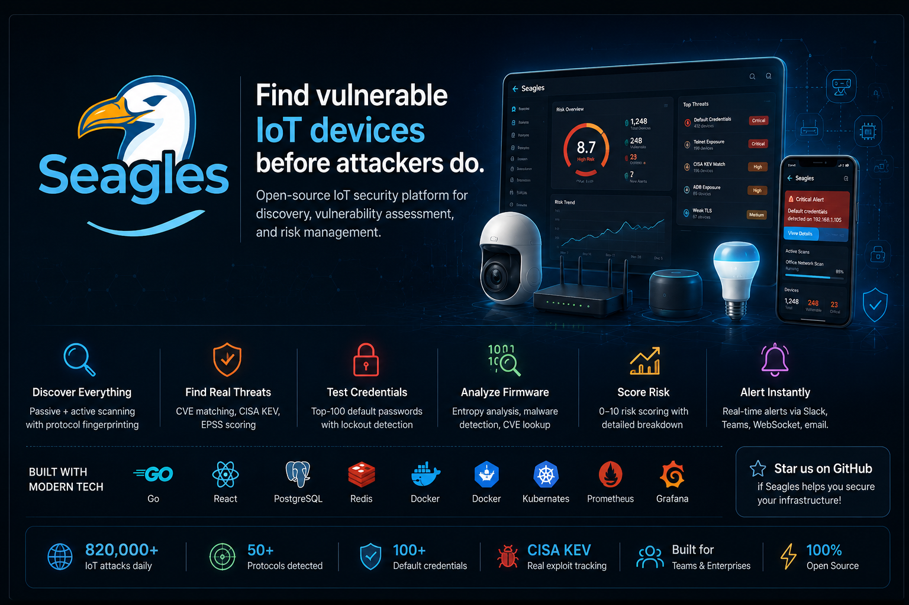
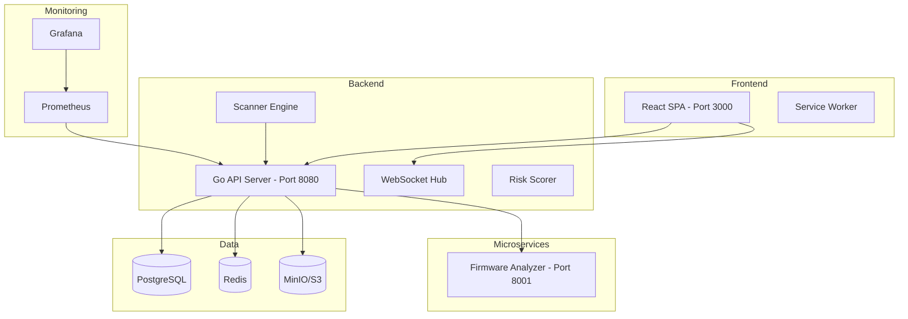

# Seagles

<p align="center">
  
</p>

**Open-source IoT security platform. Find vulnerable devices before attackers do.**

[](LICENSE)
[](https://go.dev)
[](https://nodejs.org)
[](https://docker.com)
[](https://kubernetes.io)
[](frontend/public/manifest.json)

---

## What this does

820,000 IoT attacks happen every day. Most are through default credentials that nobody changed. Most companies have no idea what IoT devices are on their network, let alone whether they're secure.

Seagles discovers every IoT device on your network, scans them for real CVEs, tests for default credentials (admin/admin, root/root — the ones botnets use), analyzes firmware for malware indicators, and scores each device's risk from 0 to 10. When something is wrong, you know immediately.

---

## Features

- **Device Discovery** — Passive (gopacket) + active (nmap) scanning with protocol fingerprinting
- **Vulnerability Detection** — CVE matching, CISA KEV, EPSS scoring with circuit breaker
- **Credential Testing** — Top-100 default credential pairs, rate-limited with lockout detection
- **Protocol Fingerprinting** — Telnet, ADB, MQTT, Modbus, RTSP, TLS version/cipher detection
- **Firmware Analysis** — Entropy scoring, binwalk, magic byte validation, CVE lookup (Python microservice)
- **Risk Scoring** — 0-10 additive score with per-factor breakdown
- **Real-time Alerts** — WebSocket push, Slack/Teams/Syslog webhooks, email-ready
- **RBAC** — 4 roles (viewer, auditor, operator, admin) with 50+ granular permissions
- **Audit Logging** — All write operations logged for compliance (90-day retention)
- **PWA** — Installable, offline-capable, service worker with push notifications
- **Monitoring** — Built-in Prometheus metrics + Grafana dashboards (4 pre-built)
- **Scan Management** — Scan profiles, scopes, safelists, scheduled scanning
- **Kubernetes** — Production-ready manifests with HPA, NetworkPolicy, RBAC

---

## Quick Start

### Docker (recommended)

```bash
git clone https://github.com/Nciibi/seagles
cd seagles
cp .env.example .env
# Edit .env: set your network CIDR (e.g. 192.168.1.0/24)
docker compose up -d
open http://localhost:3000
```

Default credentials: `admin` / `changeme`

Trigger your first network scan:

```bash
curl -X POST http://localhost:8080/api/v1/scan/network
```

### Quick Start Script (Windows)

```powershell
.\scaffold.ps1
```

### Makefile

```bash
make help          # List all targets
make build         # Build backend + frontend
make docker-up     # Start all services
make test          # Run all tests
make lint          # Run all linters
```

---

## What it detects

| Threat | Real-world Example | How Seagles Catches It |
|---|---|---|
| **Default credentials** | Mirai botnet (820K attacks/day) | Tests top-100 credential pairs per device, scores 9.5 CVSS if found |
| **Telnet exposure** | Aisuru botnet (20+ Tbps DDoS) | Detects open port 23, creates Critical alert immediately |
| **CISA KEV matches** | AVTECH CVE-2024-7029 | Cross-references every CVE against CISA's active exploit list (1100+ entries) |
| **ADB exposure** | BadBox 2.0 (10M pre-infected devices) | Detects port 5555 ADB banner, flags as supply chain risk |
| **Industrial protocols** | April 2026 ICS advisories (Honeywell, Mitsubishi) | Fingerprints Modbus (502) and BACnet (47808), scores Critical |
| **Firmware malware** | Supply chain implants | Shannon entropy analysis: score >7.2 = encrypted/packed payload |
| **Unencrypted MQTT** | 24% of IoT apps have TLS issues | Detects port 1883 without TLS, flags cleartext broker |
| **Unauthenticated RTSP** | Nation-state camera surveillance (Feb 2026) | RTSP OPTIONS without auth challenge = exposed stream |
| **Weak TLS** | Deprecated protocol attacks | Tests TLS 1.0/1.1 support, flags weak ciphers (RC4, DES, MD5) |

---

## Architecture



See [docs/architecture.md](docs/architecture.md) for detailed diagrams.

---

## Requirements

- **Docker** and **Docker Compose** (v2+)
- **Linux host** recommended for full nmap scanner functionality
  - On Mac/Windows (Docker Desktop): basic scanning works, but `network_mode: host` behaves differently
  - For full scanner capability, use a Linux VM or dedicated machine
- **2GB RAM**, **10GB disk**
- **Optional**: NVD API key (free at [nvd.nist.gov](https://nvd.nist.gov)) for faster CVE lookups

---

## Configuration

| Variable | Description | Default |
|---|---|---|
| `DB_PASSWORD` | PostgreSQL password | `changeme_strong_password_here` |
| `NETWORK_CIDR` | Network range to scan (e.g. `192.168.1.0/24`) | `192.168.1.0/24` |
| `NVD_API_KEY` | NIST NVD API key for faster CVE lookups | *(empty — uses public rate limit)* |
| `JWT_SECRET` | RSA private key PEM (auto-generated if empty) | *(auto-generated)* |
| `JWT_PRIVATE_KEY_FILE` | Path to PEM key file on disk | *(empty)* |
| `PORT` | Backend API port | `8080` |
| `FIRMWARE_ANALYZER_URL` | Firmware analyzer service URL | `http://firmware-analyzer:8001` |
| `ALLOWED_ORIGINS` | CORS/WebSocket origin whitelist (comma-separated) | `http://localhost:3000` |
| `REDIS_URL` | Redis connection string (optional, falls back to in-memory) | *(empty)* |
| `RATE_LIMIT_PER_MIN` | Default rate limit per IP | `60` |
| `LOG_LEVEL` | Logging verbosity | `info` |
| `S3_ENDPOINT` | S3-compatible storage endpoint | `minio:9000` |
| `SLACK_WEBHOOK_URL` | Slack webhook for alerts | *(empty)* |
| `TEAMS_WEBHOOK_URL` | Microsoft Teams webhook | *(empty)* |
| `GRAFANA_PASSWORD` | Grafana admin password | `admin` |

See `.env.example` for the complete list.

---

## Documentation

| Document | Description |
|---|---|
| [docs/setup.md](docs/setup.md) | Full setup guide (Linux, macOS, Windows, K8s) |
| [docs/api.md](docs/api.md) | Complete API reference with request/response schemas |
| [docs/architecture.md](docs/architecture.md) | Architecture diagrams, data flow, middleware chain |
| [docs/troubleshooting.md](docs/troubleshooting.md) | Common issues and solutions |
| [docs/adr.md](docs/adr.md) | Architecture Decision Records (15 decisions) |
| [CHANGELOG.md](CHANGELOG.md) | Release history and version tracking |
| [CONTRIBUTING.md](CONTRIBUTING.md) | How to contribute code |
| [SECURITY.md](SECURITY.md) | Vulnerability disclosure policy |
| [THREAT_MODEL.md](THREAT_MODEL.md) | Threat model and risk analysis |

---

## Adding new checks

1. **Add a vulnerability check function** in `backend/scanner/` — return a `ProtocolFinding` struct
2. **Call `alerts.CreateAlert()`** with the appropriate type constant from `alerts/engine.go`
3. **Add a risk factor** to the `RiskFactors` struct in `risk/scorer.go`
4. **Update `CalculateRiskScore()`** with the new factor's point value
5. **Add tests** in the corresponding `*_test.go` file
6. **Open a PR** with a test and update the README "What it detects" table

---

## Risk Scoring

Every device gets a 0–10 risk score. The scoring is additive:

| Factor | Points |
|---|---|
| Default credentials found | +4.0 |
| ADB exposed | +3.5 |
| Telnet open | +3.0 |
| Modbus detected | +2.5 |
| High-entropy firmware | +2.0 |
| KEV match | +2.0 per match (max +4.0) |
| Unauthenticated RTSP | +2.0 |
| Weak TLS | +1.5 |
| Plaintext MQTT | +1.5 |
| HTTP management | +1.0 |
| Firmware outdated | +1.0 |
| Known CVEs | +0.5 per CVE (max +3.0) |

**Score ranges:** 0–2.9 Low (green) · 3–5.9 Medium (blue) · 6–7.9 High (amber) · 8–10 Critical (red)

---

## Deployment Options

| Method | Docs | Use Case |
|---|---|---|
| Docker Compose | [docs/setup.md](docs/setup.md) | Local dev, small deployments |
| Kubernetes | `k8s/` manifests | Production, HA, auto-scaling |
| Manual (no Docker) | [docs/setup.md](docs/setup.md) | Custom environments |

### Kubernetes

Production-ready manifests are in `k8s/`:

```bash
kubectl apply -f k8s/
```

Includes: Deployments, Service, Ingress, HPA, NetworkPolicy, PVC, RBAC.

---

## Responsible Use

**Seagles performs active network scanning and credential testing.** Only use it on networks you own or have explicit written permission to test. Unauthorized scanning may be illegal in your jurisdiction.

Built-in safety measures:

- 500ms delay between credential attempts
- Maximum 50 credential pairs per device per scan
- Lockout detection via HTTP 429 and response body analysis
- Full audit logging of every credential test
- Safelist support to exclude known-safe devices

---

## License

MIT — see [LICENSE](LICENSE) for details.

---

*Seagles — built to be real, built to find threats before attackers do.*
