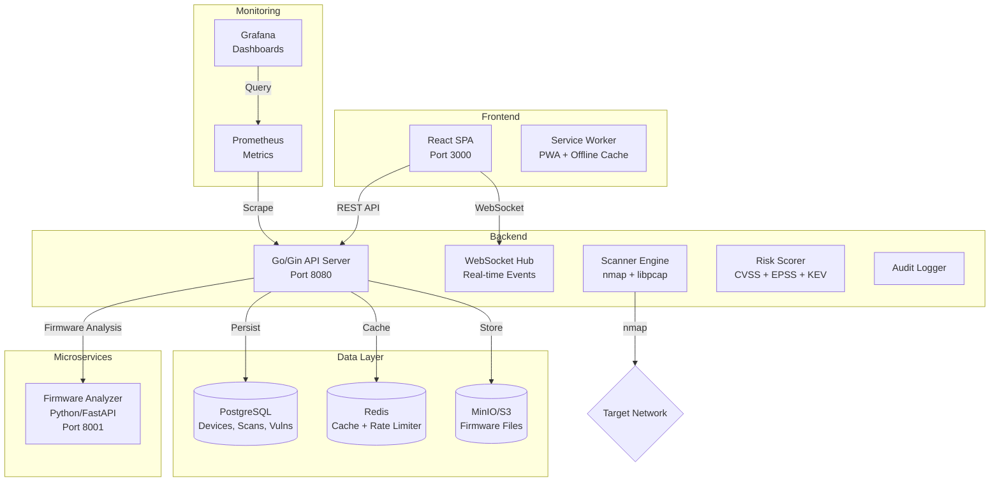
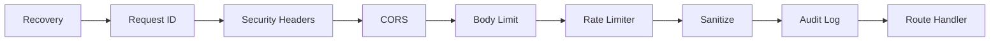
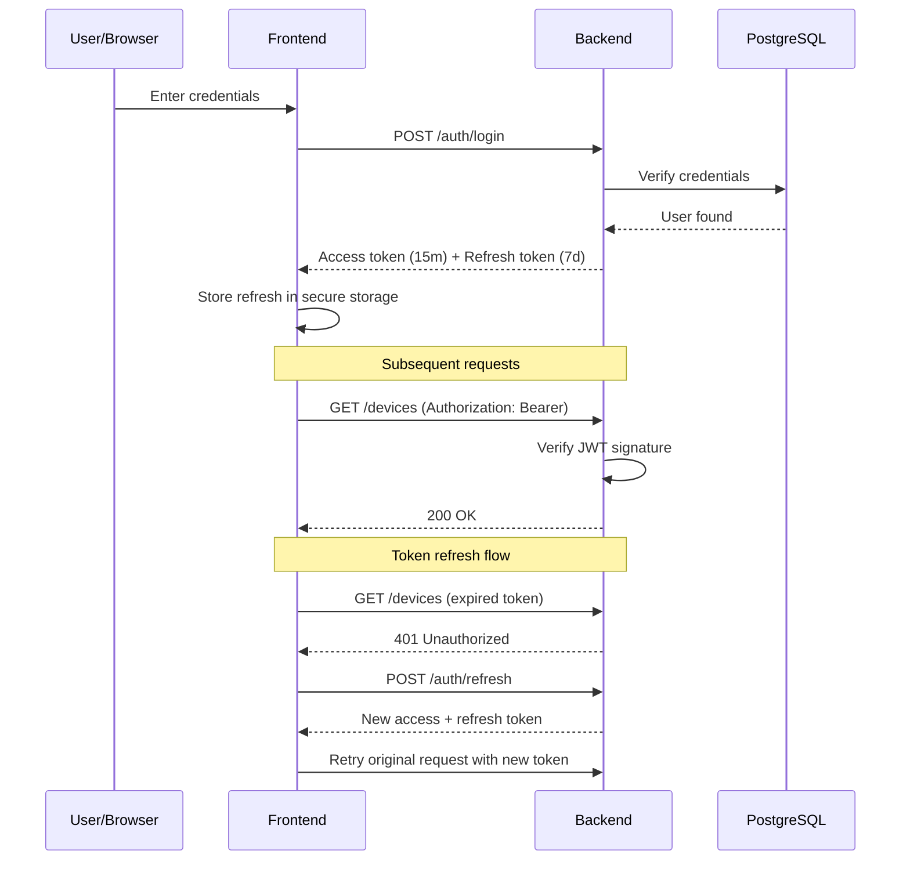
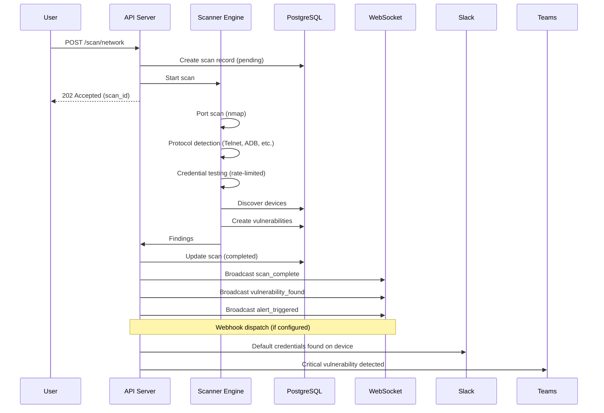
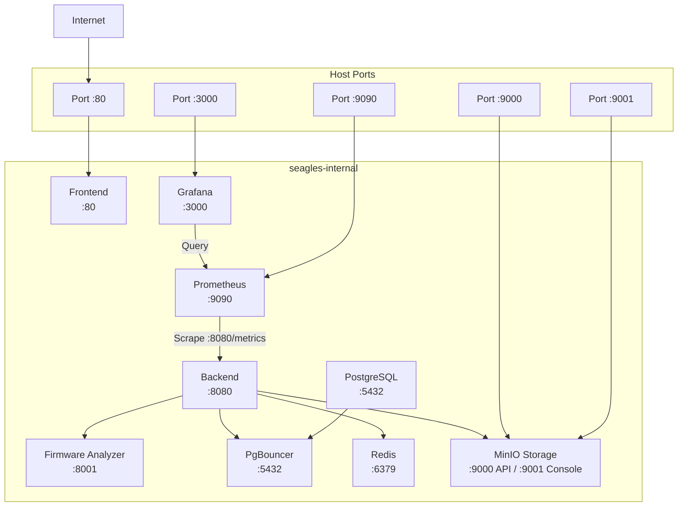
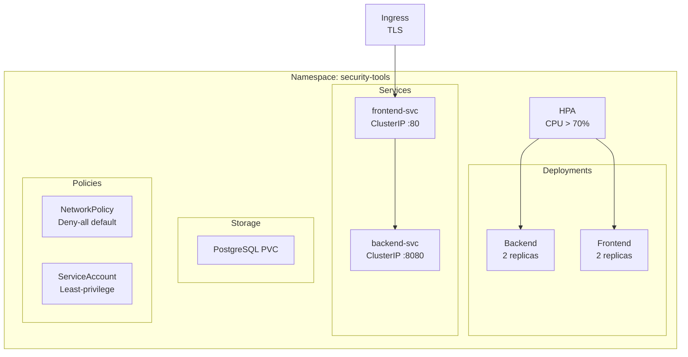
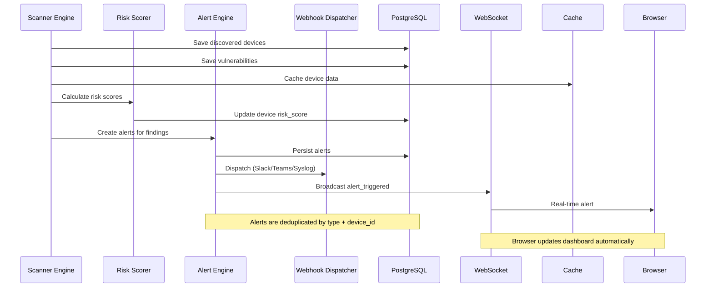

# Architecture

## Overview

Seagles is an IoT security platform that discovers devices on a network, scans them for vulnerabilities, analyzes firmware, and provides risk scoring. It consists of three main components: a Go backend, a React frontend with PWA support, and a Python firmware analysis microservice.



## Backend Architecture

### Directory Structure

```
backend/
├── main.go              # Entry point, graceful shutdown, version banner
├── api/                 # HTTP handlers + router
│   ├── router.go        # Route definitions, middleware chain, health/metrics
│   ├── ws.go            # WebSocket hub + origin whitelist
│   ├── swagger.go       # OpenAPI docs endpoint
│   ├── devices.go       # Device CRUD handlers
│   ├── scans.go         # Scan listing and status
│   ├── alerts.go        # Alert listing and acknowledgment
│   ├── firmware.go      # Firmware upload + analysis
│   ├── vulnerabilities.go # Vulnerability listing and resolution
│   ├── safelists.go     # IP/MAC safe list management
│   ├── webhooks.go      # Webhook CRUD + test
│   ├── sessions.go      # Session management
│   ├── risks.go         # Risk breakdown endpoint
│   └── kev.go           # KEV status endpoint
├── auth/                # Authentication & authorization
│   ├── auth.go          # Handlers (login, register, refresh, logout, me, permissions)
│   ├── tokens.go        # RS256 JWT core (sign, verify, refresh, blacklist)
│   └── rbac.go          # Role/permission definitions
├── alerts/              # Alert engine
│   ├── engine.go        # Alert creation, dedup, severity mapping
│   └── webhooks.go      # Webhook dispatch (Slack, Teams, Syslog)
├── breaker/             # Circuit breaker for external APIs
│   ├── breaker.go       # State machine (Closed/Half-Open/Open)
│   └── breaker_test.go  # Tests + benchmarks
├── cache/               # In-memory TTL cache + token blacklist
│   ├── cache.go         # Generic Cache[T] with TTL
│   ├── blacklist.go     # Token blacklist (24h max TTL)
│   ├── cache_test.go    # Cache tests
│   └── blacklist_test.go # Blacklist tests
├── config/              # Environment config loading
│   ├── config.go        # Config struct + LoadConfig() + Validate()
│   └── config_test.go   # Config validation tests
├── db/                  # Database connection + migrations
│   ├── db.go            # Connection pool, health monitor, auto-reconnect
│   └── migrations/      # 13 SQL migration files
├── kev/                 # CISA KEV + EPSS feed updaters
│   ├── updater.go       # KEV catalog fetcher + parser
│   └── epss.go          # EPSS score fetcher
├── middleware/           # Cross-cutting concerns
│   ├── audit.go         # Audit logging for write ops
│   ├── audit_test.go    # Audit middleware tests
│   ├── ratelimit.go     # Per-endpoint rate limiter
│   ├── ratelimit_test.go # Rate limiter tests
│   ├── sanitize.go      # XSS filtering, file validation
│   ├── sanitize_test.go # Sanitizer tests
│   ├── tls.go           # TLS enforcement + cert pinning
│   ├── tls_test.go      # TLS middleware tests
│   ├── csrf.go          # CSRF protection (optional)
│   ├── csrf_test.go     # CSRF tests
│   ├── health.go        # DB health monitor
│   ├── metrics.go       # Prometheus metrics
│   └── metrics_test.go  # Metrics tests
├── models/              # Data models
│   ├── alert.go         # Alert struct
│   ├── device.go        # Device struct
│   ├── firmware.go      # Firmware struct
│   ├── scan.go          # Scan struct
│   └── vulnerability.go # Vulnerability struct
├── retention/           # Data retention policies
│   ├── retention.go     # Audit log cleanup (90-day retention)
├── risk/                # Risk scoring engine
│   ├── scorer.go        # CalculateRiskScore(), RiskFactors
│   ├── scorer_test.go   # Unit tests
│   ├── scorer_db_test.go # DB-integrated tests
│   └── scorer_bench_test.go # Benchmarks
├── scanner/             # Network scanning
│   ├── credentials.go   # Default credential testing (top-100 pairs)
│   ├── nmap.go          # nmap wrapper with worker pool
│   ├── nmap_test.go     # Scanner tests
│   ├── passive.go       # gopacket passive monitoring
│   ├── ports.go         # Port definitions
│   ├── protocols.go     # Protocol detection (Telnet, ADB, MQTT, Modbus, RTSP)
│   ├── protocols_test.go # Protocol detection tests (local TCP servers)
│   └── tls.go           # TLS version/cipher detection
├── slog/                # Structured logging
│   ├── slog.go          # Minimal structured logger with levels
│   └── slog_test.go     # Logger tests
└── tests/               # Integration tests
    └── integration_test.go
```

### Middleware Chain

Requests flow through this pipeline:



### Authentication Flow



### Scan Lifecycle



## Frontend Architecture

```
frontend/
├── src/
│   ├── main.tsx              # Entry point + PWA registration
│   ├── App.tsx               # Layout, routing, logout
│   ├── index.css             # Tailwind base styles
│   ├── vite-env.d.ts         # Vite type declarations
│   ├── api/
│   │   ├── client.ts         # Axios client + refresh interceptor
│   │   └── client.test.ts    # API client tests
│   ├── pages/                # Route-level components
│   │   ├── Dashboard.tsx     # Overview with stats + charts
│   │   ├── Login.tsx         # Login form
│   │   ├── Login.test.tsx    # Login page tests
│   │   ├── Devices.tsx       # Device inventory list
│   │   ├── DeviceDetail.tsx  # Single device view with risk breakdown
│   │   ├── Vulnerabilities.tsx # Vulnerability listing
│   │   ├── Alerts.tsx        # Alert feed
│   │   ├── Firmware.tsx      # Firmware upload + analysis
│   │   └── Settings.tsx      # User/settings page
│   ├── components/           # Reusable components
│   │   ├── AlertFeed.tsx     # Real-time alert display
│   │   ├── DeviceInventory.tsx # Device table with virtual scrolling
│   │   ├── DeviceInventory.test.tsx
│   │   ├── ErrorBoundary.tsx # Error boundary wrapper
│   │   ├── ErrorBoundary.test.tsx
│   │   ├── FirmwarePanel.tsx # Firmware analysis results
│   │   ├── Loading.tsx       # Loading spinner
│   │   ├── Loading.test.tsx
│   │   ├── NetworkMap.tsx    # Network topology visualization
│   │   ├── RiskScore.tsx     # Risk score gauge + breakdown
│   │   ├── RiskScore.test.tsx
│   │   ├── VirtualScroller.tsx # Virtual scrolling for large lists
│   │   └── VulnScanner.tsx   # Vulnerability scanner view
│   ├── utils/
│   │   └── helpers.ts        # Utility functions
│   ├── test/
│   │   └── setup.ts          # jest-dom matchers
│   └── styles/               # CSS modules
├── public/
│   ├── sw.js                 # Service Worker
│   └── manifest.json         # PWA manifest
├── vitest.config.ts          # Vitest configuration
└── vite.config.ts            # Vite configuration
```

### Frontend Tech Stack

| Library | Purpose |
|---|---|
| React 18 | UI framework |
| React Router v6 | Client-side routing |
| TailwindCSS | Utility-first CSS |
| Recharts | Data visualization (risk charts, trends) |
| Axios | HTTP client with interceptors |
| Vitest | Unit testing |

### PWA / Service Worker

The service worker implements:
- **Cache-first** strategy for static assets (app shell)
- **Network-first** strategy for API calls
- Offline dashboard data caching
- Versioned cache busting on deploy
- Push notification support

## Firmware Analyzer

```
firmware-analyzer/
├── main.py            # FastAPI app with Pydantic v2 models
├── analyze.py         # Analysis logic (entropy, binwalk, decompile)
├── cve_lookup.py      # CVE matching against firmware metadata
└── Dockerfile
```

The firmware analyzer is a Python/FastAPI microservice that:
1. Receives firmware files from the backend via HTTP
2. Computes Shannon entropy score (threshold >7.2 indicates encrypted/packed)
3. Extracts filesystem images (binwalk integration)
4. Scans strings for indicators (default creds, backdoor keywords)
5. Matches firmware versions against known CVEs
6. Returns structured analysis results

## Network Architecture (Docker Compose)



## Kubernetes Architecture



## Key Design Decisions

| Decision | Rationale |
|---|---|
| RS256 JWT | Asymmetric keys allow public key distribution without exposing private key |
| Refresh tokens in DB | Allows server-side revocation (password change, admin force-logout) |
| In-memory cache | Zero external dependency; swap to Redis is one-line change |
| Circuit breaker | Prevents cascading failure when CISA/EPSS/NVD APIs are down |
| Worker pool (20) | Controls resource usage during network scans |
| DB health monitor | Auto-reconnect prevents permanent loss of DB connectivity |
| Audit logging | All write ops logged for compliance and incident response |
| Origin whitelist (WS) | Prevents unauthorized WebSocket connections from unknown origins |
| Isolated Docker network | Removed `network_mode: host` for security isolation |
| File validation by magic bytes | Prevents extension-only trust; reads first 512 bytes |
| XSS filtering middleware | Strips dangerous HTML/script from all incoming JSON |
| PgBouncer pooling | Transaction-mode pooling reduces PostgreSQL connection overhead |
| Retention policy | 90-day audit log retention for compliance requirements |

## Data Flow


