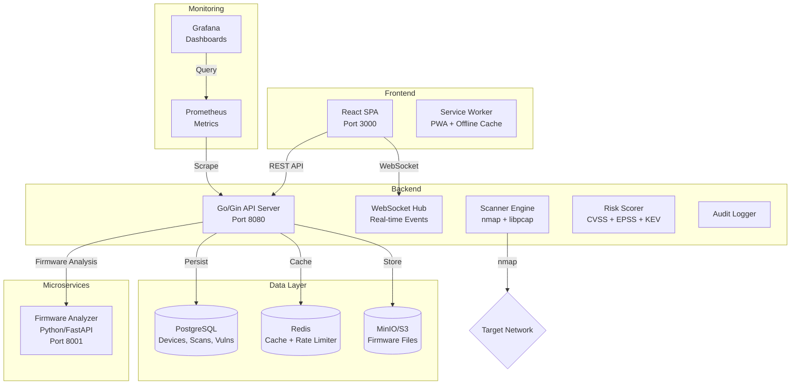
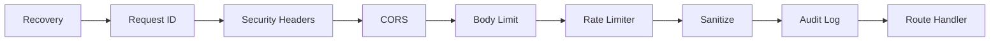
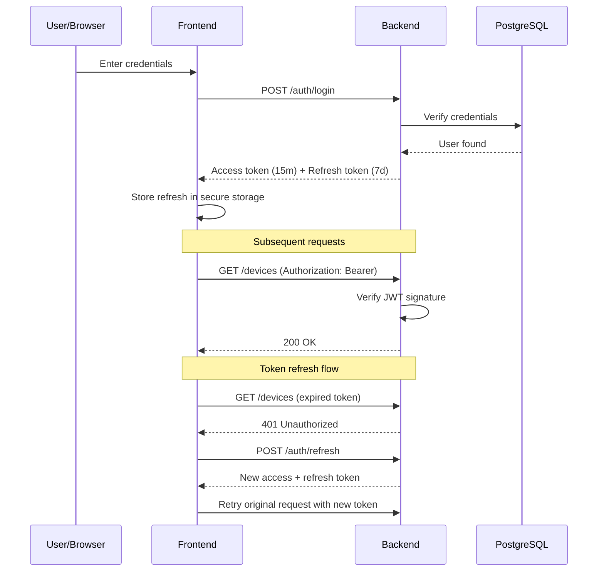
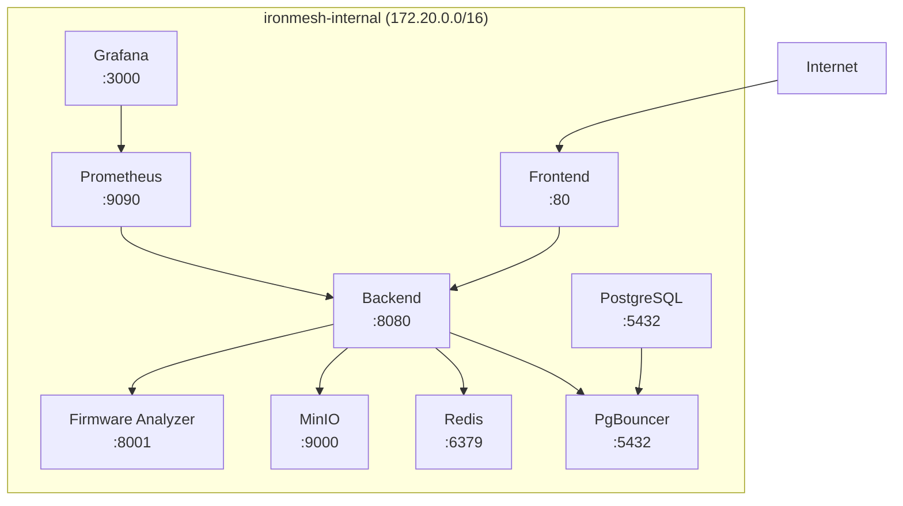

# Architecture

## Overview

IronMesh is an IoT security platform that discovers devices on a network, scans them for vulnerabilities, analyzes firmware, and provides risk scoring. It consists of three main components:



## Backend Architecture

```
backend/
├── main.go          # Entry point, graceful shutdown
├── api/             # HTTP handlers + router
│   ├── router.go    # Route definitions, middleware chain
│   ├── ws.go        # WebSocket hub + origin whitelist
│   ├── swagger.go   # OpenAPI docs endpoint
│   ├── handlers.go  # Devices, scans, vulns, alerts CRUD
│   ├── firmware.go  # Firmware upload + analysis
│   ├── safelist.go  # IP/MAC safe list management
│   ├── webhooks.go  # Webhook CRUD + test
│   ├── scopes.go    # Scan scope management
│   ├── profiles.go  # Scan profile CRUD
│   ├── users.go     # User management
│   └── health.go    # Health check + stats
├── auth/            # Authentication & authorization
│   ├── auth.go      # Handlers (login, register, refresh, logout)
│   ├── tokens.go    # RS256 JWT core
│   └── rbac.go      # Role/permission definitions
├── breaker/         # Circuit breaker for external APIs
├── cache/           # In-memory TTL cache + token blacklist
├── config/          # Environment config loading
├── db/              # Database connection + migrations
│   └── migrations/  # 13 SQL migration files
├── kev/             # CISA KEV + EPSS feed updaters
├── middleware/       # Cross-cutting concerns
│   ├── audit.go     # Audit logging for write ops
│   ├── ratelimit.go # Per-endpoint rate limiter
│   ├── sanitize.go  # XSS filtering, file validation
│   ├── tls.go       # TLS enforcement + cert pinning
│   └── metrics.go   # Prometheus metrics
├── models/          # Data models
├── risk/            # Risk scoring engine
├── scanner/         # Network scanning
│   ├── protocols.go # Protocol detection (Telnet, ADB, MQTT, etc.)
│   ├── credentials.go # Default credential testing
│   ├── tls.go       # TLS version/cipher detection
│   └── passive.go   # gopacket passive monitoring
├── slog/            # Structured logging
├── alerts/          # Alert engine + dedup
└── tests/           # Integration tests
```

### Middleware Chain

Requests flow through this pipeline:



### Authentication Flow



## Frontend Architecture

```
frontend/
├── src/
│   ├── main.tsx         # Entry point + PWA registration
│   ├── App.tsx          # Layout, routing, logout
│   ├── api/client.ts    # Axios client + refresh interceptor
│   ├── pages/           # Route-level components
│   │   ├── Dashboard.tsx
│   │   ├── Login.tsx
│   │   ├── Devices.tsx
│   │   ├── DeviceDetail.tsx
│   │   ├── Vulnerabilities.tsx
│   │   ├── Alerts.tsx
│   │   ├── Firmware.tsx
│   │   └── Settings.tsx
│   ├── components/      # Reusable components
│   │   ├── ErrorBoundary.tsx
│   │   ├── Loading.tsx
│   │   ├── DeviceInventory.tsx
│   │   ├── RiskScore.tsx
│   │   ├── AlertFeed.tsx
│   │   ├── FirmwarePanel.tsx
│   │   ├── VulnScanner.tsx
│   │   ├── NetworkMap.tsx
│   │   └── VirtualScroller.tsx
│   ├── test/            # Test setup
│   │   └── setup.ts     # jest-dom matchers
│   └── styles/          # CSS modules
├── public/
│   ├── sw.js            # Service Worker
│   └── manifest.json    # PWA manifest
├── vitest.config.ts     # Vitest configuration
└── vite.config.ts       # Vite configuration
```

## Firmware Analyzer

```
firmware-analyzer/
├── main.py       # FastAPI app with Pydantic v2 models
├── analyze.py    # Analysis logic (entropy, binwalk, decompile)
├── cve_lookup.py # CVE matching against firmware metadata
└── Dockerfile
```

## Network Architecture (Docker Compose)



## Key Design Decisions

| Decision | Rationale |
|----------|-----------|
| RS256 JWT | Asymmetric keys allow public key distribution without exposing private key |
| Refresh tokens in DB | Allows server-side revocation (password change, admin force-logout) |
| In-memory cache | Zero external dependency; swap to Redis is one-line change |
| Circuit breaker | Prevents cascading failure when CISA/EPSS/NVD APIs are down |
| Worker pool (20) | Controls resource usage during network scans |
| DB health monitor | Auto-reconnect prevents permanent loss of DB connectivity |
| Audit logging | All write ops logged for compliance and incident response |
| Origin whitelist (WS) | Prevents unauthorized WebSocket connections from unknown origins |
| Isolated Docker network | Removed `network_mode: host` for security isolation |
